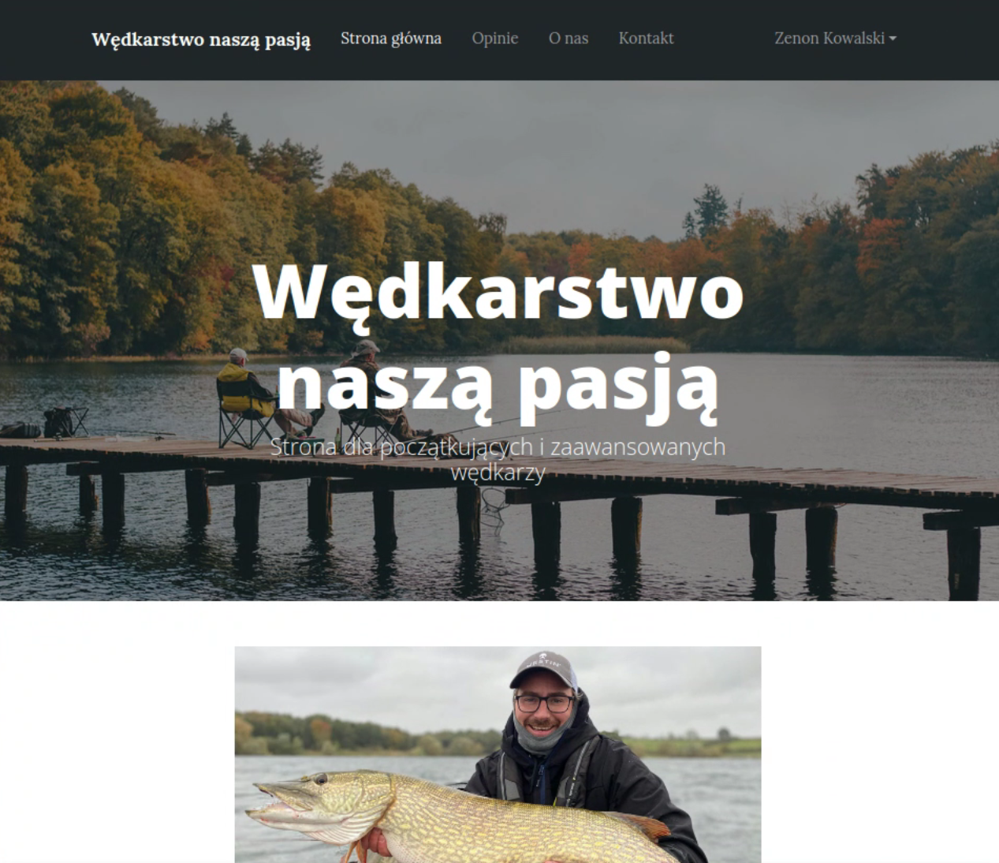

# Strona internetowa sklepu wędkarskiego (MEAN Stack)




## Opis projektu
Aplikacja ta to serwis internetowy – blog sklepu wędkarskiego. Aplikacja umożliwia użytkownikom przeglądanie aktualności, zapoznanie się z ofertą sklepu oraz interakcję poprzez system opinii. System został wdrożony w środowisku klastra Kubernetes (Minikube).

## Zastosowany stack technologiczny: MEAN
Aplikacja oparta jest na nowoczesnym stosie technologicznym **MEAN**, składającym się z:

1.  MongoDB - nierelacyjna baza danych przechowująca informacje o użytkownikach, postach i opiniach.
2.  Express.js: Lekki framework backendowy obsługujący logikę biznesową i REST API.
3.  Angular: Framework frontendowy (SPA) zapewniający dynamiczny i responsywny interfejs użytkownika.
4.  Node.js: Środowisko uruchomieniowe dla warstwy serwerowej.

## Implementacja w środowisku Kubernetes (Minikube)

### 1. Architektura i komponenty
Aplikacja została podzielona na niezależne, konteneryzowane komponenty:

*   **Frontend (Angular + Nginx):**
    *   Aplikacja kliencka jest budowana do wersji produkcyjnej i serwowana przez wydajny serwer **Nginx**.
    *   Wdrożona jako **Deployment** z **2 replikami**, co zapewnia ciągłość działania podczas aktualizacji (Rolling Update) oraz awarii jednego z podów.
    *   Wykorzystuje sondę **Readiness** do weryfikacji dostępności serwera HTTP.

*   **Backend (Node.js/Express):**
    *   Działa jako bezstanowy (stateless) **Deployment** (również **2 repliki**).
    *   Komunikuje się z bazą danych wykorzystując wewnętrzny DNS klastra.
    *   Posiada zaimplementowany endpoint `/health`, wykorzystywany przez Kubernetes do sprawdzania, czy połączenie z bazą danych jest aktywne (sonda **Readiness**). Wykorzystuje też sondę Liveness do restartu w przypadku zawieszenia.

*   **Baza danych (MongoDB):**
    *   Wdrożona jako **StatefulSet** (zamiast Deployment), co jest kluczowe dla systemów przechowywania danych. Zapewnia to stałą tożsamość sieciową (`fishing-shop-db-0`).
    *   Wykorzystuje **PersistentVolumeClaim (PVC)** do trwałego przechowywania danych. Dzięki temu dane nie są tracone po restarcie poda lub klastra.
    *   Udostępniona wewnątrz klastra poprzez **Headless Service**.

### 2. Konfiguracja i bezpieczeństwo
W projekcie zastosowano mechanizmy separacji konfiguracji od kodu:

*   **Secrets:** Dane wrażliwe (hasła do bazy danych, klucze prywatne JWT, Salt) są przechowywane w zakodowanych obiektach `Secret` i wstrzykiwane do kontenerów jako zmienne środowiskowe.
*   **ConfigMaps:** Konfiguracja niewrażliwa (np. porty aplikacji) przechowywana jest w `ConfigMap`.
*   **Network Policies:** Baza danych akceptuje połączenia wyłącznie od Backendu i Seedera. Ruch wychodzący z aplikacji (Backend, Frontend) został zablokowany, z wyjątkiem komunikacji z bazą danych oraz usługami DNS.

### 3. Dostęp zewnętrzny (Ingress)
Aplikacja nie jest wystawiona bezpośrednio przez NodePort. Zastosowano kontroler **Ingress**, który zarządza ruchem przychodzącym pod domeną `brilliantapp.zad`. Ingress odpowiada za routing:
*   Ruch na `/api` i `/auth` -> kierowany do Backendu.
*   Pozostały ruch -> kierowany do Frontendu.

### 4. Automatyzacja (Job)
Proces inicjalizacji bazy danych (Seeding) został wyodrębniony z kodu backendu i zrealizowany jako jednorazowy obiekt **Kubernetes Job**. Uruchamia się on równolegle z aplikacją, zasila bazę danymi startowymi i kończy działanie, nie obciążając dalej klastra.

### 5. Zarządzanie zasobami (Resources)
Każdy kontener posiada zdefiniowane limity (**Limits**) oraz żądania (**Requests**) dla CPU i pamięci RAM.

## Uruchomienie

Wymagane jest środowisko Minikube z włączonymi dodatkami `ingress`.

```bash
# 1. Zbudowanie obrazów w środowisku Minikube
eval $(minikube docker-env)
# ... build docker images ...

# 2. Uruchomienie manifestów
kubectl apply -R -f k8s/

# 3. Dostęp
# Aplikacja dostępna pod adresem: http://brilliantapp.zad
# (Wymaga dodania wpisu w /etc/hosts)